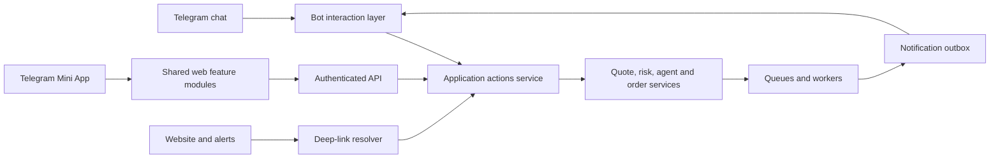

# Telegram Product Upgrade Plan

## Goal and product rules

Telegram becomes AstroidBot's conversational control surface while the Mini App handles charts, search, allocation, and strategy forms. Chat remains the approval and notification channel. The bot, web app, Mini App, and workers must use the same backend services.

1. AI may propose or prepare an action, but only a typed server action can quote, validate, or execute it.
2. Trades, orders, wallet deletion, autonomous mode, and material risk changes require a deterministic preview and explicit confirmation.
3. Verify Telegram `initData` on the server. Never trust client fields directly.
4. Deep links carry opaque, expiring, single-use IDs. They never carry secrets or authority-bearing payloads.
5. Render shared view models in web and Telegram; keep business logic out of callback handlers.
6. Make asynchronous notification delivery idempotent and observable.

Create reusable modules:

- `src/services/actions/`: action drafts, ownership, previews, expiry, confirmation, idempotency, and dispatch.
- `src/services/deepLinks/`: opaque link creation and resolution.
- `src/services/telegramDelivery/`: topic routing, formatting, retry, and action buttons.
- `src/services/agentReporting/`: structured decisions and channel-neutral report models.
- `web/src/lib/telegram/`: SDK bridge for auth, theme, viewport, Back Button, haptics, and dialogs.
- `web/src/features/`: shared feature components used by desktop and `/tg/*` routes.

## Phase 0 — Safe shared foundations

### Typed pending actions

Add a `PendingAction` table with UUID, user, kind, validated JSON payload, status, quote snapshot, expiry, timestamps, source, and unique idempotency key. Kinds include trade, limit order, alert, strategy, agent mode, and risk setting. Implement `prepare`, `preview`, `confirm`, and `cancel`. Confirmation repeats ownership and risk checks and rejects changed, expired, or consumed actions.

Migrate Telegram trade confirmation to this service before adding Mini App mutations.

### Delivery outbox

Add `NotificationDelivery` with notification, channel, destination, topic, state, attempts, provider message ID, idempotency key, and timestamps. Workers write domain events and outbox rows transactionally. A delivery worker retries transient failures.

Exit criteria:

- Web and Telegram render the same prepared action.
- Double confirmation cannot execute twice.
- Expired quotes require a fresh preview.
- Worker restarts cannot duplicate alerts.

## Phase 1 — Telegram Mini App

### Launch authentication

Add `POST /api/auth/telegram-mini-app`. Accept raw `Telegram.WebApp.initData`, verify its signature with the bot token, enforce a short `auth_date` lifetime, reject replay, resolve the existing `telegramId`, and return the normal short-lived application session. Test valid, invalid, expired, replayed, inactive-user, and account-conflict cases.

### Runtime adapter

Create `TelegramAppProvider` exposing capability-checked theme variables, safe-area insets, viewport/fullscreen state, Telegram Back Button mapped to React Router, Main/Bottom Button, haptics, native confirmation, close behavior, start parameter, and browser fallbacks. Feature components must not access the Telegram global directly.

### Shared routes

Add `/tg`, `/tg/trade`, `/tg/tokens`, `/tg/portfolio`, `/tg/wallets`, `/tg/orders`, and `/tg/agents`. Extract current page bodies into shared hooks and components. Desktop and Telegram routes differ only in shell and navigation.

Use the Mini App for dense visual work. A material submission creates a `PendingAction`; the backend sends its final approval card to chat. The Mini App displays status but cannot bypass chat approval.

### Launch surfaces

Configure the Main Mini App and menu button. Add context-specific Web App buttons to bot screens. Put only opaque route references in `startapp`. Use compact/fullscreen modes only when supported.

Exit criteria:

- Telegram launch needs no second login.
- Normal browser login and routes still work.
- Theme, safe areas, Back Button, and fallback behavior work across Telegram clients.
- A Mini App trade cannot execute without chat confirmation.

## Phase 2 — Deep-linked workflows

Store `telegram:link:<nonce>` records in Redis with target kind, resource ID, expected user where needed, source, and expiry. Generate random base64url values within Telegram's 64-character start parameter limit and consume one-time links atomically.

Support token, agent, order, transaction, alert settings, pending-action preview, referral, and onboarding targets. Parse bot `/start <parameter>` and Mini App `start_param` through one resolver. Authenticate and check ownership before routing. Expired links show recovery actions.

Exit criteria:

- Web pages and alerts open the intended resource.
- Forwarded user-bound links reveal nothing and grant no access.
- Replay, expiry, and malformed-link tests pass.

## Phase 3 — Streaming AI with actions

Extend `AIOrchestrator` with an async stream emitting text deltas, progress events, final typed `ActionSuggestion[]`, model metadata, latency, and completion reason. Define suggestions as a closed Zod union: ``preview_trade`, `open_token`, `create_alert`, `open_portfolio`, and `build_strategy`. The model never supplies ownership fields or dispatches jobs.

Build a Telegram draft writer that uses one draft ID per response, preserves topic ID, batches to no more than one update per second, truncates safely, supports stop/cancellation, and sends a persistent final message because drafts expire. Fall back to typing plus a normal message. Final buttons come only from validated suggestions; “Preview trade” prepares an action and never confirms it.

Expose the same stream to the web Chat page over SSE or the existing WebSocket manager.

Exit criteria:

- Users see useful output quickly.
- Stop cancels generation and pending tool preparation.
- Rate-limit, truncation, and fallback tests pass.
- Free-form AI output cannot perform a financial mutation.

## Phase 4 — Explainable agent reports

Add `AgentDecision` with agent/strategy/user/wallet/chain/cycle IDs, market snapshot reference, rule and signal values, regime, AI audit and confidence multiplier, risk checks, rejection reasons, proposed actions, results, rationale, timestamps, and model metadata.

Write one record for executed, rejected, suppressed, and no-action cycles. Build a channel-neutral report model with Observation, Trigger, Confidence, Risk, Action, and Result sections. Render a compact Telegram card and detailed expandable web view.

Telegram actions include Inspect position, View transaction, Pause agent, Adjust setting, and Explain more. Resolve ownership on every callback and use `PendingAction` where approval is required.

Exit criteria:

- Every cycle has an auditable decision.
- Users can understand actions and skipped actions.
- Reports contain no secrets or provider credentials.

## Phase 5 — Personalized alerts

Add `AlertPreference`, keyed by user, channel, and event type, for trade status, order status, agent decisions/failures, risk events, low gas, and price changes. Store cadence (`instant`, `digest`, `muted`), quiet hours, timezone, severity, destination topic, and event-specific settings. Use a separate `PriceAlert` model for chain, token, condition, threshold, cooldown, and status.

Build one settings feature for web and Mini App. Telegram alerts receive Mute type, Snooze 1h, Daily digest, View asset, and Adjust threshold buttons. Call an alert service rather than Prisma from callbacks. Add deduplication, cooldowns, quiet-hour deferral, digest aggregation, and delivery metrics.

Exit criteria:

- Users control noise without disabling every alert.
- Duplicate worker events produce one delivery.
- Mute and snooze apply immediately and remain reversible.

## Phase 6 — Private-chat topics

Enable Threaded Mode in BotFather behind `TELEGRAM_TOPICS_ENABLED`. Add `TelegramTopic`, keyed by user and purpose, storing thread IDs for Assistant, Trades and Orders, Agent Reports, and Risk Alerts.

Create topics lazily and repair mappings when users delete them. Make every outbound delivery accept a purpose and resolve `message_thread_id`. Preserve the incoming thread for AI replies and streaming. Offer “Organize chat” as optional onboarding. If topic creation or delivery fails, fall back to General and record degraded routing.

Exit criteria:

- AI, execution, agent, and risk traffic remain separated.
- Replies and drafts stay in the originating topic.
- Deployments without Threaded Mode retain current behavior.

## Phase 7 — Profile presentation and launch

Prepare a profile icon, light/dark splash screens, a short intent-to-result demo, localized screenshots, bot description, command copy, privacy policy, support route, and terms. Configure Main Mini App previews in BotFather.

Add a skippable first-run tour, theme-matched skeletons, clear offline/stale-price/unsupported-client states, full screen only for charts, and an Add to Home Screen prompt after the user receives value. Track launch source, authentication, preview, confirmation, completion, retention, alert opt-out, and AI-action acceptance without recording secrets, raw `initData`, tokens, or sensitive prompts.

Launch gates:

- Production HTTPS and approved BotFather domains
- Narrow CSP updates without wildcard sources
- Mini App authentication security review
- Telegram records included in export/deletion
- Accessibility, localization, and slow-network/client testing
- Team → 5% → 25% → 100% rollout with server kill switches

## Delivery order

| Milestone | Scope | Outcome |
|---|---|---|
| M1 | Phase 0 and deep-link core | Safe actions and stable entry points |
| M2 | Mini App auth, shell, Portfolio, Tokens | Read-only value before mutations |
| M3 | Mini App Trade, Orders, Wallets, Agents | Complete chat-approved workflows |
| M4 | Streaming AI and actionable results | AI targets stable actions and screens |
| M5 | Decision records and alert preferences | Explainable retention loops |
| M6 | Private topics and profile launch | Organized delivery and public release |

Use independent flags: `TELEGRAM_MINI_APP_ENABLED`, `TELEGRAM_STREAMING_ENABLED`, `TELEGRAM_TOPICS_ENABLED`, and `TELEGRAM_ALERT_PREFERENCES_ENABLED`.

## Success measures

- Mini App launch-to-auth success
- Time to first useful AI draft
- AI suggestion open and confirmation rates
- Action expiry and abandonment rates
- Trade/order confirmation errors
- Duplicate notification rate
- Alert mute/unsubscribe rate
- Agent-report opens and Explain-more use
- Seven-day retention after a confirmed action

The program is complete when a user can enter from chat, web, a notification, or the Mini App; reach the same resource; receive streamed AI help; prepare and approve a typed action in Telegram; observe execution; understand agent decisions; and tune future alerts without authorization or behavior drifting between surfaces.
