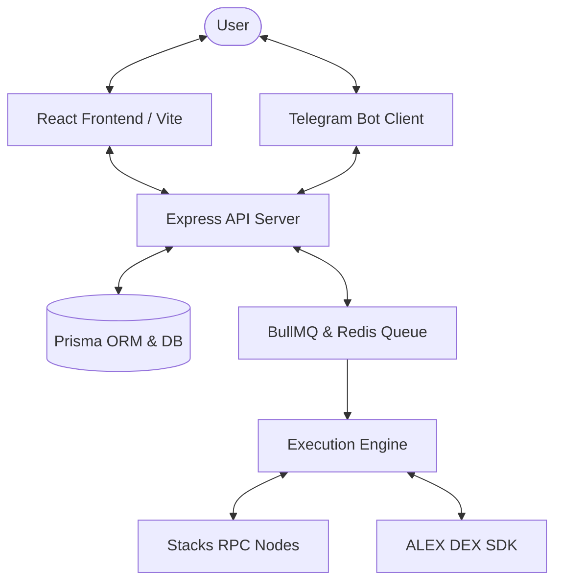

# Stacks Grant Proposal: Proof of Concept & Technical Architecture

## Current Prototype Status
AstroidBot has a working prototype that unifies wallet management, AI parsing, and automated trade execution. 

Key functional components include:
- **Interactive Chat Assistant**: Users can type commands to retrieve token balances, query market prices, or set up automated limit orders.
- **Limit Order Management**: Users can define target buy/sell prices, which are saved to the database and monitored by the backend engine.
- **Dynamic Dashboard**: Includes live portfolio visualization, asset balances, active agents, limit order lists, and transaction history.
- **Multi-wallet Support**: Supports generation and management of secure Stacks wallets, allowing parallel trading strategies without nonce collisions.

---

## Technical Architecture

### 1. Frontend Layer
- **Framework**: React 19, Vite, TypeScript.
- **Styling**: TailwindCSS v4 (using CSS variables for light/dark themes).
- **State & Fetching**: TanStack Query (React Query) for caching and auto-refresh.
- **Visualization**: Recharts and Lightweight Charts for real-time portfolio analytics.

### 2. Backend Layer
- **Runtime**: Node.js, TypeScript, ESM.
- **API Framework**: Express.
- **Database**: Prisma ORM with SQLite (development) and Postgres (production) compatibility.
- **Task Queue**: Redis-backed BullMQ for job scheduling, recurring price checks, and reliable transaction broadcasting.

### 3. Stacks & DeFi Integrations
- **Stacks SDK**: `@stacks/transactions` and `@stacks/network` for transaction building, signing, and broadcasting.
- **ALEX DEX SDK**: Fetches live pools, pricing data, and routes swap transactions.
- **AI Engine**: Core LLM integrations for processing natural-language inputs into execution intents.
